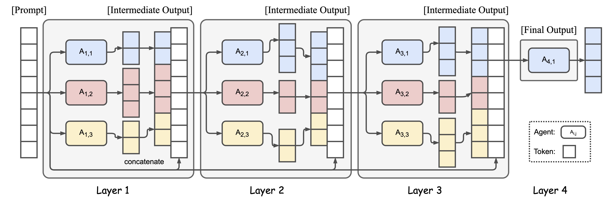

## Mixture of Agents


### Overview
Mixture of Agents (MoA) is a novel approach that leverages the collective strengths of multiple LLMs to enhance performance, achieving state-of-the-art results. By employing a layered architecture where each layer comprises several LLM agents, MoA significantly outperforms GPT-4 Omni’s 57.5% on AlpacaEval 2.0 with a score of 65.1%, using only open-source models!

This examples contains the implementation of mixture of agents via light agents.

### Setup

1. Clone the repository:
   ```sh
   git clone https://github.com/itsAdee/Light-Agents
   cd Light-Agents
   ```

2. Install dependencies using Poetry:
   ```sh
   poetry install
   ```

3. Set up your environment variables:
   Create a `.env` file in the project root and add your Together API key:
   ```sh
   TOGETHER_API_KEY=your_api_key_here
   ```

### Running the Script

1. Activate the Poetry shell:
   ```sh
   poetry shell
   ```

2. Run the script:
   ```sh
   python examples/mixture_of_agents/main.py
   ```

